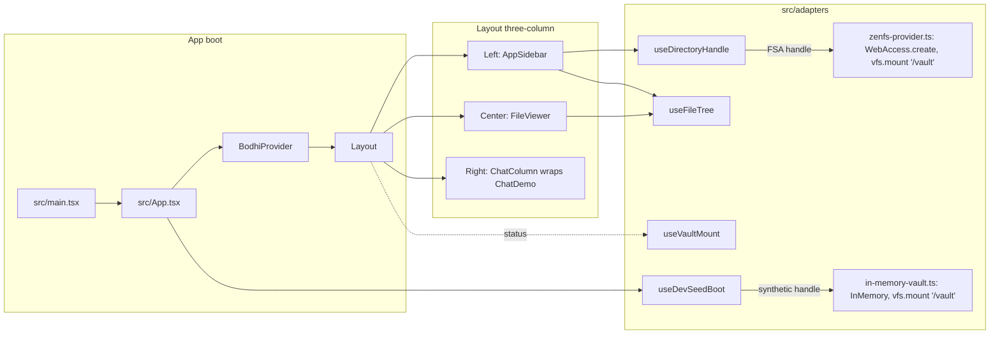

# Stage 1 — make `web-bash` look like `zenfs-browser`

## Decisions locked in

- Mount path: `/vault`. Seed global: `window.__zenfsSeed`. Status testid: `span-vault-status`. (Parity with `zenfs-browser` so `installVault`, page objects, and selectors port over cleanly.)
- Center column: read-only viewer (no save/editor). Writes get exercised by the bash tool in Stage 2.
- New DOM attributes use `data-test-state` (hyphenated, matches reference). Existing app code that uses `data-teststate` (Bodhi badges, `section-auth`) stays untouched.
- Stage 1 new e2e tests do not require Bodhi login. The existing chat spec keeps its full login/model-select flow.

## Architecture overview

## Dependencies

Add to [web-bash/package.json](web-bash/package.json):
- runtime: `@zenfs/core`, `@zenfs/dom`, `idb-keyval`
- no test deps (Playwright already present)

No changes to `just-bash` root deps in Stage 1.

## New / modified files

### Adapters (new)

- [web-bash/src/adapters/zenfs-provider.ts](web-bash/src/adapters/zenfs-provider.ts) — `VAULT_MOUNT = "/vault"`; `mountVault(handle)` calls `configure({ mounts: {} })`, `WebAccess.create({ handle })`, `vfs.mount("/vault", …)`; `unmountVault()`; exports a typed `VaultPorts` (mount/unmount/createProvider).
- [web-bash/src/adapters/in-memory-vault.ts](web-bash/src/adapters/in-memory-vault.ts) — `InMemoryVaultSeed = { files: Record<string,string>, name: string }`; `createInMemoryVaultAdapter(seed)` returns ports that mount an `InMemory` backend at `/vault`, then `mkdir -p` + `writeFile` each seeded path; `createInMemoryDirectoryHandle(name)` produces the synthetic `FileSystemDirectoryHandle` that `useFileTree` can read as if it were an FSA handle. Sets `window.__zenfsFs = fs.promises` for e2e introspection.
- [web-bash/src/adapters/zenfs-fs-provider.ts](web-bash/src/adapters/zenfs-fs-provider.ts) — thin `FileSystemProvider` interface around ZenFS `fs` for the future bash tool. Created now so Stage 2 wiring stays mechanical.

### Hooks (new)

- [web-bash/src/hooks/useDirectoryHandle.ts](web-bash/src/hooks/useDirectoryHandle.ts) — state `{ status: 'empty'|'prompt'|'ready', handle? }`; `open()` calls `showDirectoryPicker({ mode: 'readwrite' })`; persist/restore via `idb-keyval`; `restore()` requests permission on page load if possible.
- [web-bash/src/hooks/useVaultMount.ts](web-bash/src/hooks/useVaultMount.ts) — status `'idle'|'mounting'|'ready'|'error'`; runs `ports.mount(handle)`.
- [web-bash/src/hooks/useFileTree.ts](web-bash/src/hooks/useFileTree.ts) — recursive read via `dirHandle.entries()`; exposes `tree`, `selected`, `select(path)`, `readSelected(): Promise<{ text, isBinary }>`.
- [web-bash/src/hooks/useDevSeedBoot.ts](web-bash/src/hooks/useDevSeedBoot.ts) — if `import.meta.env.DEV` and `window.__zenfsSeed`, dynamically imports `in-memory-vault`, creates ports + synthetic handle, mounts, returns `{ ready, boot }`.

### UI (restructure)

- [web-bash/src/App.tsx](web-bash/src/App.tsx) — call `useDevSeedBoot()`; if a seed boot is active, use its synthetic handle; otherwise drive real FSA ports. Keep `BodhiProvider` + `useBodhi` behavior unchanged.
- [web-bash/src/components/Layout.tsx](web-bash/src/components/Layout.tsx) — replace single-column layout with shadcn `SidebarProvider` + `AppSidebar` (left) and a `SidebarInset` that contains the top `Header` plus a horizontal flex row of `FileViewer` (flex-1) and `ChatColumn` (`w-[380px]`, `border-l`). Wrap the right column in `
`. Keep `TooltipProvider` + `Toaster`.
- [web-bash/src/components/AppSidebar.tsx](web-bash/src/components/AppSidebar.tsx) *(new)* — "Open folder" button (`btn-sidebar-open`), vault status row (`span-vault-status` + `data-test-state`), dir name (`span-sidebar-dirname`), recursive tree (`div-tree-<sanitizedPath>`, `btn-tree-toggle-<path>` on dirs). Container wrapper `div-sidebar-container` with `data-test-state` = `loaded` | `empty`.
- [web-bash/src/components/FileViewer.tsx](web-bash/src/components/FileViewer.tsx) *(new)* — `div-viewer-container` with `data-test-state` = `empty` | `loading` | `loaded` | `unsupported`; renders `pre-viewer-content` for text; `p-viewer-unsupported` for binary. Detects binary by sniffing NUL bytes in the first 4KB.
- [web-bash/src/components/Header.tsx](web-bash/src/components/Header.tsx) — unchanged except adding a breadcrumb `nav-viewer-breadcrumb` (mirrors reference) showing the selected file path.
- [web-bash/src/components/chat/ChatDemo.tsx](web-bash/src/components/chat/ChatDemo.tsx) — no logic changes; just make sure it renders at the narrower 380px width without layout regressions. Adjust `ChatMessages` container if needed.

### Playwright (tests, pages, helpers)

- [web-bash/e2e/helpers/install-vault.ts](web-bash/e2e/helpers/install-vault.ts) *(new, ported from reference)* — walks `e2e/data/<vaultName>/` and `page.addInitScript` with `{ files, name }` on `window.__zenfsSeed`. Signature: `installVault(page: Page, vaultName: string): Promise<void>`.
- [web-bash/e2e/data/sample-project/](web-bash/e2e/data/sample-project/) *(new fixture)* — minimal: `README.md`, `notes/todo.md`, `src/index.ts` (text), a small `logo.bin` (binary) so the unsupported state is exercised.
- [web-bash/e2e/pages/FileBrowserPage.ts](web-bash/e2e/pages/FileBrowserPage.ts) *(new)* — locators + helpers:
  - `vaultStatus()`, `waitVaultReady()`, `dirName()`
  - `treeNode(path)`, `toggleDir(path)`, `openFile(path)`
  - `viewerState()`, `viewerText()`, `breadcrumb()`
  - `readVirtualFile(path)` via `page.evaluate(p => window.__zenfsFs.readFile(p, 'utf8'), path)`
- [web-bash/e2e/vault-mount.spec.ts](web-bash/e2e/vault-mount.spec.ts) *(new)* — **no login**. Steps:
  1. `installVault(page, 'sample-project')` then `page.goto('/')`
  2. Assert `span-vault-status` reaches `ready` and `span-sidebar-dirname` shows `sample-project`
  3. Assert `div-sidebar-container` `data-test-state = loaded`; tree contains `README.md`, `notes/todo.md`, `src/index.ts`
  4. Expand `notes/`, open `todo.md`, assert viewer state `loaded` and `pre-viewer-content` contains the fixture text; assert breadcrumb matches
  5. Open `README.md`, assert viewer switches and content changes
  6. Open `logo.bin`, assert viewer state `unsupported` and `p-viewer-unsupported` visible
- [web-bash/e2e/chat.spec.ts](web-bash/e2e/chat.spec.ts) — only touched if the new layout shifts a testid. The chat testids (`chat-input`, `send-button`, `chat-message-turn-*`, `badge-*-status`, `section-auth`) are preserved because they live on inner components. Expected: no change required. Re-run to confirm.
- [web-bash/e2e/tests/pages/ChatPage.ts](web-bash/e2e/tests/pages/ChatPage.ts) — no changes planned. Mentioned in the user request as "update if needed"; only edit if a selector actually fails against the new layout.

### Config touches

- [web-bash/playwright.config.ts](web-bash/playwright.config.ts) — unchanged. Dev port (65173) and `baseURL` already aligned.
- [web-bash/.github/workflows/ci.yml](web-bash/.github/workflows/ci.yml) — unchanged; new `vault-mount.spec.ts` runs under the same `ci:test:e2e` target.

## Verification (must all pass before commit)

Run from [web-bash/](web-bash/):
- `npm run lint`
- `npm run typecheck`
- `npm test` (vitest)
- `npm run test:e2e` — both the existing `chat.spec.ts` (login + model + assistant turn) and the new `vault-mount.spec.ts` must be green.

Single Stage 1 commit once all four are clean.

## Stage 2 preview (not part of this commit)

After Stage 1 lands, Stage 2 installs `just-bash` via a file: dep and adds a `bash.exec` `AgentTool` backed by the `/vault` ZenFS (wrapped as `IFileSystem`). Phases — each with one narrative Playwright spec following `installVault` + `ChatPage.send` patterns:

1. read-only FS (`ls`, `cat`, `head`, `tail`, `wc`, `stat`, `pwd`, `find`, `tree`)
2. text processing (`grep`/`fgrep`/`egrep`/`rg`, `sed`, `awk`, `cut`, `sort`, `uniq`, `tr`, `jq`, `diff`)
3. write / mutation (`mkdir`, `rmdir`, `rm`, `cp`, `mv`, `touch`, `chmod`, `tee`, `ln`, redirections `>`, `>>`, `<`)
4. interpreter grammar (pipelines `|`, `&&`/`||`, subshells, `$(...)`, variables, `export`, `$?`, globs, brace expansion)
5. control flow (`if`, `for`, `while`, `case`, functions, `test`/`[`/`[[`, arithmetic `$((...))`, heredocs `<<`/`<<-`/`<<<`)
6. misc utilities (`base64`, `md5sum`/`sha1sum`/`sha256sum`, `date`, `seq`, `printf`, `env`, `which`, `timeout`, `sleep`, `xargs`, `gzip`/`gunzip`/`zcat` — confirm browser-zlib behavior per `src/browser.ts` note)

Excluded in the browser build and therefore out of scope (from `src/commands/browser-excluded.ts` plus `__BROWSER__` gates in `src/commands/registry.ts`): `tar`, `yq`, `xan`, `sqlite3`, `python`/`python3`, `js-exec`/`node`. `curl` is opt-in via `fetch`/`network` options and also deferred.

Only touch `just-bash/src` if a phase genuinely can't land without it; any such change ships as its own commit.
